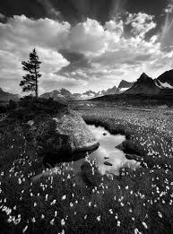

# CT2: Colorization Transformer via Color Tokens  🖌️🎨
[](https://pypi.org/project/torch/2.1.2-/)
[](https://pypi.org/project/torchvision/0.16.2-/)
[](https://pypi.org/project/numpy/1.26.4/)
[](https://pypi.org/project/Pillow/10.2.0/)


## Description
The paper "CT²: Colorization Transformer via Color Tokens," published in 2022, introduces a novel approach to image colorization that combines the strengths of transformer architectures with a unique concept: color tokens. This method addresses a common limitation in transformer-based colorization, which often results in undersaturated and muted colors.

CT² enhances colorization quality by incorporating color tokens, representing a predefined set of discrete colors within a specific color space (e.g., ab space). Each color token corresponds to a unique patch in this color space grid. Within the transformer framework, these tokens interact with features extracted from grayscale images, enabling the model to map grayscale features to the appropriate color tokens.

Unlike traditional methods that directly predict RGB values, CT² uses these tokens for classification. During colorization, the model assigns a probability score to each color token for every pixel. The color token with the highest score is chosen as the predicted color for that pixel, resulting in more saturated and vibrant colors.

This approach offers several advantages:

    - Enhanced Color Saturation: By treating colorization as a classification problem with predefined tokens, CT² achieves more vibrant and realistic colors.
    - Controlled Color Palette: The predefined nature of color tokens restricts the model to a realistic color palette, preventing unnatural color choices while still providing a diverse range of colorization possibilities.

## Getting started 🚀

To dive into the transformative world of CT2, begin by setting up your environment with these steps. We recommend using a virtual environment for an isolated setup.

1. **Clone the repository**

    ```bash
    git clone https://github.com/Manuelnkegoum-8/CT2.git
    cd CT2
    ```

2. **Set up a virtual environment** (optional but recommended)

    - For Unix/Linux or MacOS:
        ```bash
        python3 -m venv env
        source env/bin/activate
        ```
    - For Windows:
        ```bash
        python -m venv env
        .\env\Scripts\activate
        ```
3. **Requirements**

    ```bash
    pip install -r requirements.txt
    ```
Download the pretrained vit model **google/vit-bae-patch16-224-ink21** in the root directory and rename it vit_pretrained.bin


4. **Usage**
    - To train the model :
        ```bash
        torchrun --nproc_per_node=4 training.py --batch_size 16 --dec_mlp_dim 3072 --epochs 50
      ```

## Results 📊

I used two datastes to conduct my experiments [MS COCO 2017](https://paperswithcode.com/dataset/coco) and [Flickr30k](https://paperswithcode.com/paper/flickr30k-entities-collecting-region-to). The images were resized at the 224x224 resolution.

<div style="display: grid; grid-template-columns: repeat(5, 1fr); gap: 10px;">
  
  
  
  
  
  
  
  
  
  
  
  
  
  
  
  
  
  
  
  
</div>


## Acknowledgements 🙏 

- Immense gratitude to the original authors of the model
- Thanks to [shuchenweng](https://github.com/shuchenweng) for providing the mask_prior
- Some parts of the code was inspired from [shuchenweng](https://github.com/shuchenweng/CT2) and [Time0o](https://github.com/Time0o)

## Authors 🧑‍💻
- [Manuel NKEGOUM](https://github.com/Manuelnkegoum-8)

## References 📄 
- [CT2: Colorization Transformer via Color Tokens](https://www.ecva.net/papers/eccv_2022/papers_ECCV/papers/136670001.pdf)
- [Real-Time User-Guided Image Colorization with Learned Deep Priors](https://arxiv.org/pdf/1705.02999)
- [Colorful Image Colorization](https://arxiv.org/pdf/1603.08511)